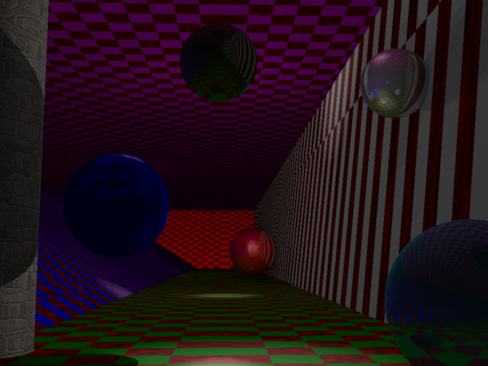
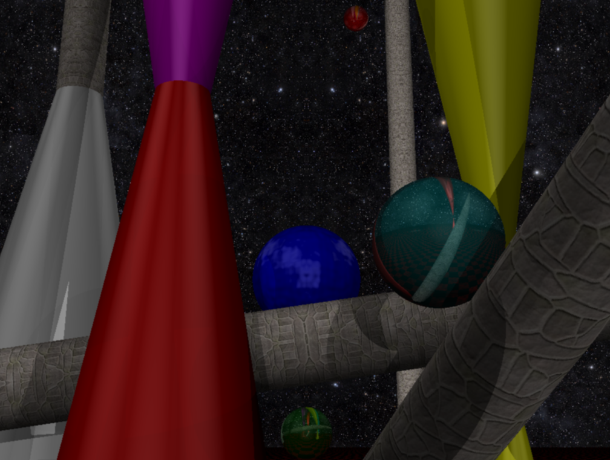

# Raytracer

Image generation by tracing the path of light as pixels in an image plane and simulating the effects of its encounters with virtual objects.

1st year school project created with the help of Quentin Fournier-Montgieux and Julien Callewaert.

## Dependencies

LibLapin

SFML

## Features

Objects: cones, cylinders, spheres, planes, hyperboloids

Customizable size/colour/textures/position/rotation


Properties: brilliance, reflection, Perlin noise

Anti-aliasing


## Commands

Arrows,A,E to rotate camera

Z,Q,S,D,B,Space to translate camera

L to activate/deactivate rendering move

## Usage

Step1: Install dependencies


Step2:
```
cd Raytracer

make

./raytracer path_to_pic.ini

```

## Examples


